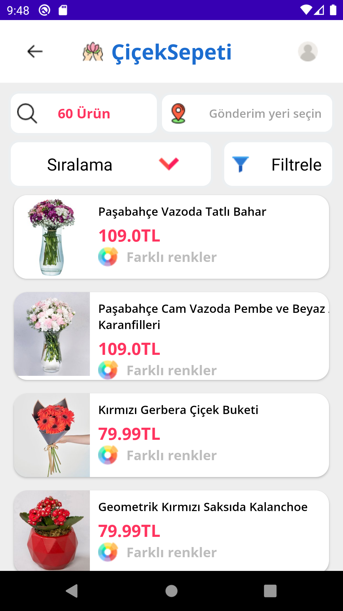
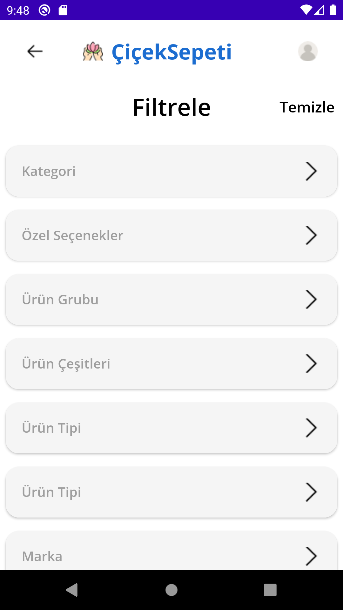

# CicekSepeti
I made a project using the api available on the https://ciceksepeti.dev/ site.

## Features

100% Kotlin <dt>
MVVM architecture <dt>
Retrofit <dt>
Android Architecture Components<dt>
ViewModel <dt>
LiveData <dt>
Data Binding <dt>
Dependency injection <dt>
Navigation component <dt>
Glide <dt>

## Splash Page

 <dt>
  

## Main Page
  
   <dt> 
    
## Detail Page
  
    
    
## Filter Page    
  
    
        
## Page    
  
